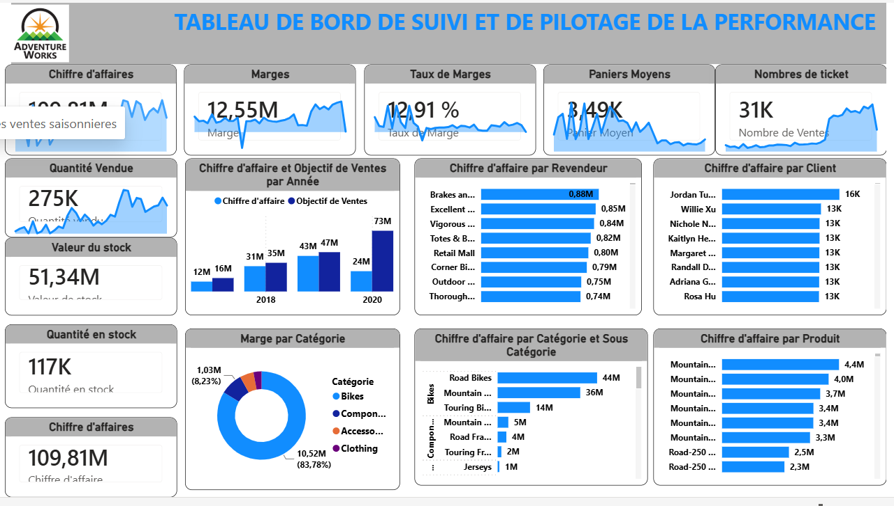

# Power BI Dashboard – Performance Monitoring

## Project Overview
Interactive Business Intelligence dashboard developed with Power BI for monitoring sales performance, margins, stock, and commercial indicators.

## Features
- Sales KPI tracking
- Margin analysis
- Stock monitoring
- Product category analysis
- Sales performance visualization
- Interactive dashboard filters

## Tools & Technologies
- Power BI
- DAX
- Excel

## Dashboard Preview

## Power BI Service Link
https://app.powerbi.com/links/Tu8DOaqXCm
